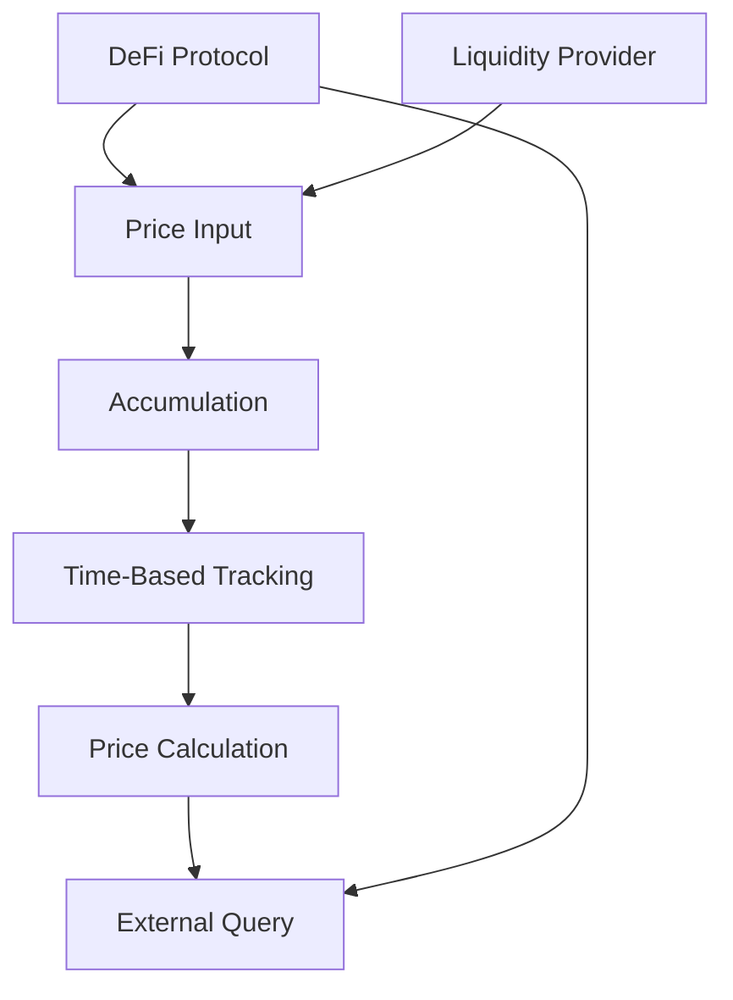

# Quick TWAP Accumulator

A high-performance Time-Weighted Average Price (TWAP) accumulator designed for decentralized finance (DeFi) applications on the Stacks blockchain.

## Overview

Quick TWAP Accumulator provides a robust, gas-efficient mechanism for calculating and storing time-weighted average prices across different trading pairs and asset pools. This contract enables precise price tracking with minimal computational overhead.

### Key Features
- Efficient TWAP calculation for multiple trading pairs
- Low gas consumption and minimal storage requirements
- Flexible accumulation intervals
- Support for various asset types and pool configurations
- Built-in safety checks and error handling

## Architecture

The TWAP Accumulator is designed as a single, modular smart contract that manages price accumulation, storage, and retrieval.



## Contract Documentation

### Core Contract: twap-accumulator.clar

#### Purpose
Provides a reliable and efficient mechanism for calculating time-weighted average prices (TWAP) for decentralized finance applications.

#### Key Components
1. **Price Accumulation**: Tracks cumulative price over time
2. **Interval Management**: Supports configurable time windows
3. **Oracle Interface**: Allows external price queries
4. **Error Handling**: Robust validation and error reporting

## Getting Started

### Prerequisites
- Clarinet installed
- Stacks wallet for deployment/interaction

### Usage Examples

1. Initialize Price Accumulator:
```clarity
(contract-call? .twap-accumulator initialize-pair 
    "STX-USDA"   ;; Trading pair
    u86400       ;; 24-hour interval
)
```

2. Update Price:
```clarity
(contract-call? .twap-accumulator update-price 
    "STX-USDA"   ;; Trading pair
    u1000000     ;; Current price (microunits)
)
```

3. Query TWAP:
```clarity
(contract-call? .twap-accumulator get-twap 
    "STX-USDA"   ;; Trading pair
    u86400       ;; 24-hour interval
)
```

## Function Reference

### Accumulator Management
- `initialize-pair`: Set up a new trading pair
- `update-price`: Record current market price
- `get-twap`: Retrieve time-weighted average price

### Configuration
- `set-accumulation-interval`: Modify price tracking window
- `pause-accumulator`: Temporarily disable price tracking
- `resume-accumulator`: Re-enable price tracking

### Administrative
- `set-admin`: Transfer contract administration
- `set-oracle-permission`: Manage price update permissions

## Development

### Local Testing
```bash
# Run local tests
clarinet test

# Check contract
clarinet check
```

### Deployment
```bash
# Deploy to testnet
clarinet deploy --testnet

# Deploy to mainnet
clarinet deploy --mainnet
```

## Security Considerations

### Limitations
- Maximum supported trading pairs
- Price update frequency restrictions
- Minimum price granularity

### Best Practices
1. Validate price sources
2. Implement oracle authentication
3. Monitor price update frequency
4. Use multiple price sources when possible
5. Implement circuit breakers for extreme price movements

### Data Privacy
- All price data is publicly accessible on-chain
- Sensitive logic implemented through access controls
- Minimal storage design reduces attack surface